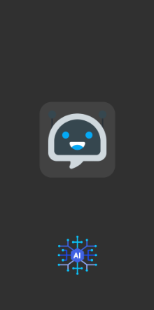
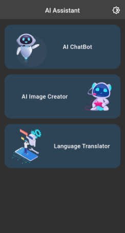
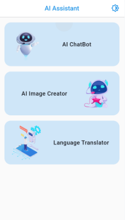
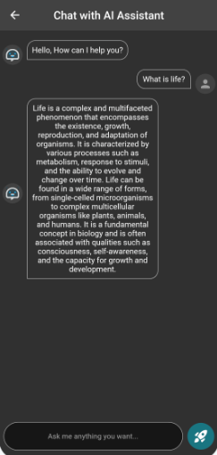
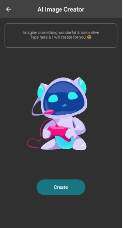
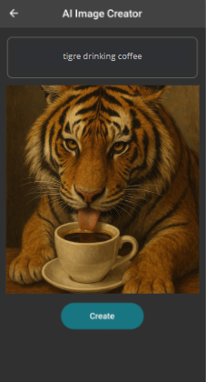

<h1>📱 Assistant AI</h1>

Une application mobile développée avec le <b>Framework Flutter</b> qui intègre les fonctionnalités 
suivantes et qui sont tous basées sur l'IA <b>Un bot de chat</b>, 
<b>La génération d'image</b>, et <b>La traduction du langue </b>.

 
<h3>✨ Fonctionnalités</h3>
<ul>
<li>Bot de chat basé sur <b>GPT</b> et <b>Google Gemini AI</b></li>
<li>Génération d'image basée sur <b>GPT</b> et <b>Lexica Image Search</b></li>
<li>Traduction linguistique basée sur <b>GPT</b> et <b>Google Translator</b></li>
<li>Interface utilisateur modèrne via <b>New Material Widgets</b></li>
<li>Animation (Lottie, Fading, Text Animation...)</li>
<li>Dark/Light mode</li>
<li>...</li>
</ul>

 
<h3>✨ Captures d'écran</h3>

**Démarrage et chargement de l'application :**

 
**Fonctionnalités de l'application (Menu principal) :**
<table>
<thead>
<tr>
<th>
Dark Mode
</th>
<th>
Light Mode
</th>
</tr>
</thead>
<tbody>
<tr>
<td>

</td>
<td>

</td>
</tr>
</tody>
</table>
 
**AI Chatbot :**

 
**AI Image Generator :**
<table>
<thead>
<tr>
<th>
Avant la génération de l'image
</th>
<th>
Après la génération de l'image
</th>
</tr>
</thead>
<tbody>
<tr>
<td>

</td>
<td>

</td>
</tr>
</tody>
</table>
 
**AI Text Translator :**

 

 
<ul>
<li>💻 <b>Réalisé par : </b>Iliasse Abdessamad</li>
<li>📚 <b>Sujet : </b>Intégration de l'ia dans une applications mobiles basé sur Flutter</li>
<li>📅 <b>Année : </b>2024 - 2025</li>
</ul>